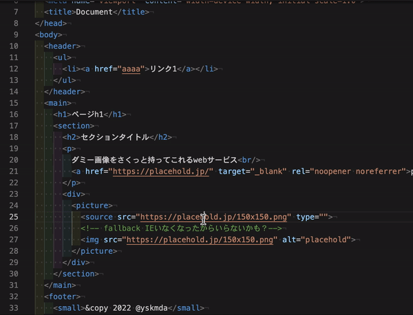
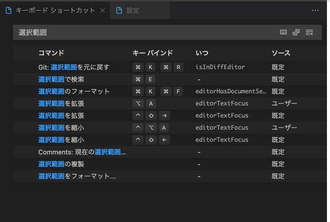
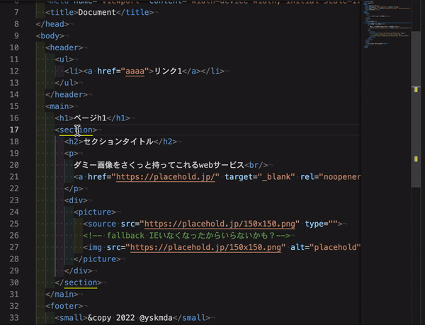
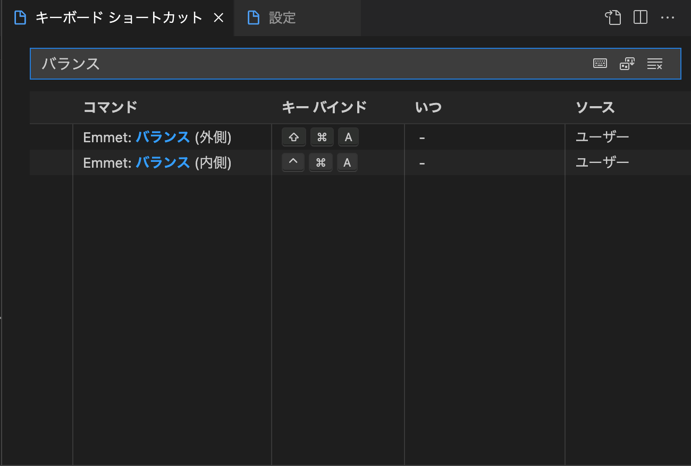
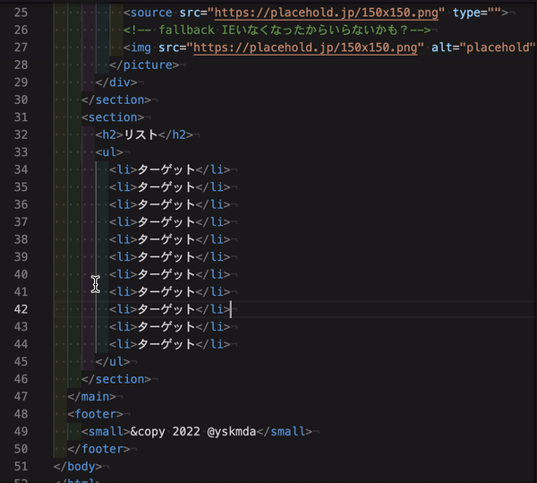
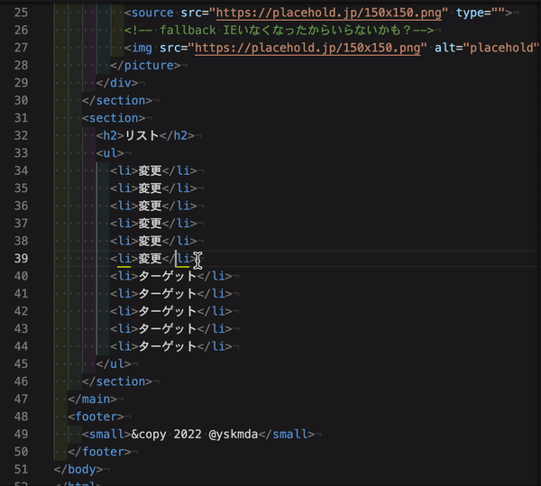
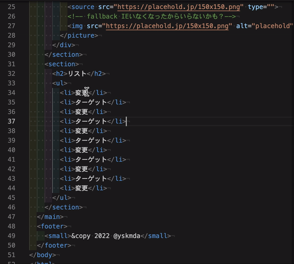

# VSCodeの設定を再編する

VSCodeを利用してきて、３年以上経ちました。
導入当時はHTML、CSS、JavaScript、JQueryを中心にマークアップをする仕事が大半でしたが、
現在は、React、VueなどのNode.jsを利用したもの、Flutterなど利用シーンに際して使いたい拡張機能が色々と異なる場合が多いです。

まずはユースケースの仕分けを行います。

## ユースケース

- HTML,CSS,JavaScriptの環境: 社員のメンバーほぼ全員に必要
- WordPressの制作環境
- React系の制作環境: Next、Gatsuby、React Appなど
- Flutter: これに関してはAndoroid Studioが優秀なので必須ではない

## HTML,CSS,JavaScriptの環境

### 欲しい機能

- ESlintによる自動整形
- Stylelintによる自動整形

このあたりは社内ルールの統一につながるので利用したいところ

### ショートカットキーの設定

#### クォーテーションの中身をすばやく選択したい

左下の歯車アイコンをクリックして、「キーボードショートカット」をクリック。

検索窓に、「選択範囲」と入力します。

「選択範囲の拡張」と「選択範囲の縮小」がそれにあたります。

私は、

「選択範囲の拡張」に Option + A

「選択範囲の縮小」に Option + Control + A

を割り当てています。

#### 特定のタグを中身ごと選択したい

「バランス」とカタカナで検索してください。

「Emmet: バランス（外側）」「Emmet: バランス（内側）」というのがそれにあたります。

私は

「Emmet: バランス（外側）」に Shift + Command + A
「Emmet: バランス（内側）」に Control + Command + A

を割り当てています。

#### その他よく利用する機能

矩形選択

| OS | 操作 |
| -- | -- |
| Windows | ［Ctrl］＋［Shift］＋［Alt］＋矢印キー |
| Mac | ［Shift］＋［Option］＋［Command］＋矢印キー|

矩形選択を独自のショートカットキーにしたい場合は

「cursorColumnSelect」で検索し、

「cursorColumnSelectRight」
「cursorColumnSelectLeft」
に独自のショートカットキーを割り当てよう。

行を移動する

| OS | 操作 |
| -- | -- |
| Windows | ［Alt］＋矢印キー |
| Mac | ［Option］＋矢印キー |

単語選択

| 用途 | 操作 |
| -- | -- |
| 現在のカーソル位置にある単語と 同じ単語を一括して選択する | ［Ctrl］＋［Shift］＋［L］キー(Windows／Linux） ［Shift］＋［Command］＋［L］キー（macOS） |
| 現在のカーソル位置にある単語と 同じ単語を1つずつ選択範囲に追加する | ［Ctrl］＋［D］キー（Windows／Linux） ［Command］＋［D］キー（macOS） |

